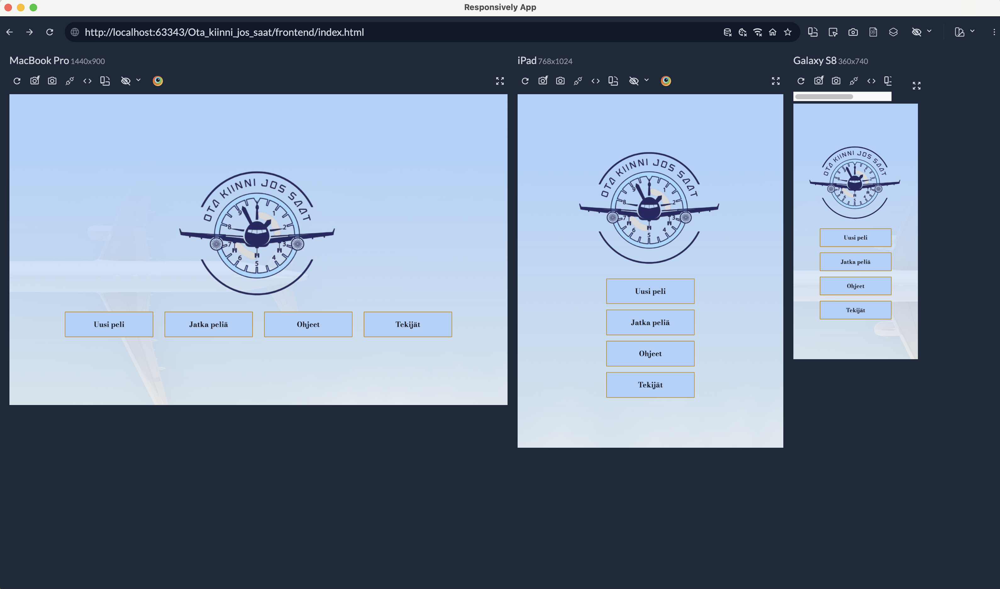
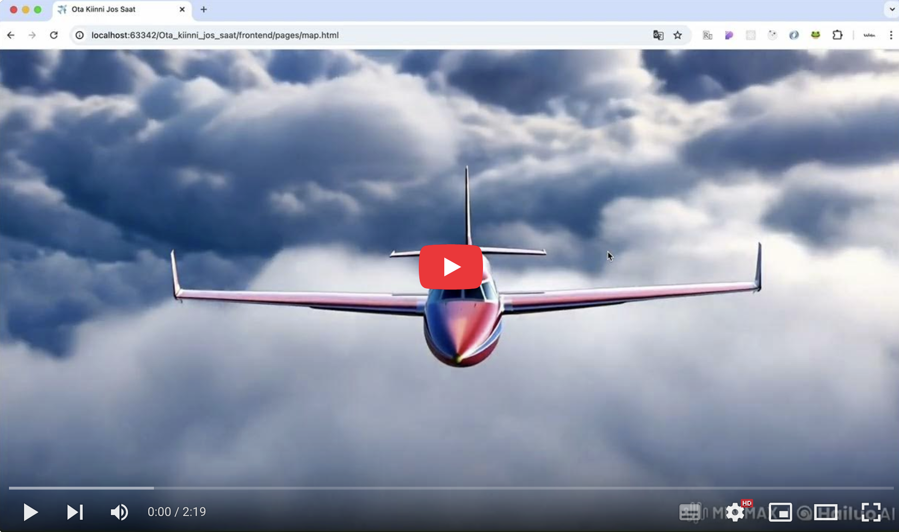

# Ota kiinni jos saat!

Tämä projekti kehitettiin osana ryhmätyötä Ohjelmisto 1 ja 2 -kursseilla Metropolia Ammattikorkeakoulussa.

---

### Sisällysluettelo
  1. [Projektin yleiskuvaus](#projektin-yleiskuvaus)
  2. [Ryhmän jäsenet](#Ryhmän-jäsenet)
  3. [Ominaisuudet](#Ominaisuudet)
  4. [Tekniset tiedot](#Tekniset-tiedot)
  5. [Pelin kuvat ja demo video](#Pelin-kuvat-ja-demo-video)

---

### Projektin yleiskuvaus

Pelin idea pohjautuu Scotland Yard -lautapeliin. Pelissä kaksi etsivää jahtaa ympäristörikollista ympäri Euroopan lentokenttiä tavoitteenaan saada hänet kiinni ennen ajan loppumista. Rikollisen liikkeet näkyvät etsiville vain satunnaisesti, mutta johtolankoja seuraamalla hänet voi jäljittää. Pelaajat liikkuvat eri lentokenttien välillä käyttämällä eri kokoisia lentokoneita ja lentolippuja.

----

### Ryhmän jäsenet

Samu Kirjonen, Alessa Pentinmikko, Doni Trivedi, Victoria Vavulina

---

### Ominaisuudet

#### Peli konsolissa:
- Peli tukee 1-3 pelaajaa, jolloin pelaajat voivat toimia joko rikollisena tai etsivänä.
- Yksinpelissä pelaaja voi valita roolin ja pelata tietokonetta vastaan.
- Kahden pelaajan tilassa toinen pelaaja ohjaa molempia etsiviä.
#### Eri kokoiset lentokoneet ja lentoliput:
- Pelaajilla on käytössä erilaisia lentolippuja, jotka rajoittavat tai mahdollistavat liikkumisen eri etäisyyksillä:
    - Potkurikone: Lähimmät kaksi lentokenttää.
    - Matkustajakone: Lähimmistä kahdesta kaksi seuraavaa lentokenttää.
    - Yksityiskone: Kaksi kauimmaista lentokenttää.
#### Kätketyt liikkeet ja johtolankojen seuraaminen:
- Rikollisen edellinen olinpaikka ja käytetty lentolippu paljastetaan etsiville kierroksilla (1, 4, 7 ja 10).
- Rikolliset näkevät joka vuorolla, mistä etsivät ovat liikkuneet ja mitä lentolippua on käytetty.
#### Pelimekaniikka:
- Jokaisella vuorolla rikollisen siirrot piilotetaan etsiviltä konsolin tyhjentämisen avulla.
#### Poikkeavien suorituspolkujen hallinta:
- Pelissä on sisäänrakennettuja virheilmoituksia, jotka käsittelevät virheelliset syötteet, kuten:
    - Liian pitkä nimimerkki.
    - Käytössä oleva tai tyhjä nimimerkki.
    - Virheellinen lentokenttävalinta.

#### Peli selaimessa:
- Peliä voi pelata yksi, kaksi tai kolme pelaajaa.‬
- Yhden pelaajan pelissä pelaaja saa päättää, että pelaako hän etsivän vai‬ rikollisen roolia ja pelaa tietokonetta vastaan.‬
- Kahden pelaajan pelissä toinen pelaajista ohjaa molempia etsiviä.‬
- Pelissä on 21 ennalta määritettyä lentokenttää.‬
- Etsivät eivät voi käyttää ensimmäisellä vuorolla yksityiskoneen lentolippua.‬
- Rikollisen edellinen olinpaikka näytetään jokaisella kierroksella.‬
- Rikollinen näkee etsivien sijainnin joka vuorolla.‬
- Peli alkaa rikollisen vuorolla.‬
- Peli päättyy kymmenen kierroksen jälkeen tai kunnes toinen etsivistä saa‬ rikollisen kiinni menemällä samalle lentokentälle, jossa rikollinen on, tai‬ rikollinen lentää samalle lentokentälle, jossa etsivä sijaitsee.‬
‭

---
  
### Tekniset tiedot
- Peli on toteutettu Python kielellä.
- Pelissä hyödynnetään MariaDB-tietokantaa.
- Pythonin ja MariaDB välinen yhteys perustuu SQL-kyselyihin.
- Pelin visuaalinen selainkäyttöliittymä on toteutettu HTML-, CSS- ja JavaScript-kielillä.
- Pelissä on hyödynnetty ulkoisia lähteitä, kuten Google Maps API:ta ja AzureOpenAI:n GPT-4o:ta
- Peli oli alun perin pelattavissa vain konsolissa, mutta se on kehitetty toimimaan selaimessa.

#### Tietokantataulut:
- airport 
- country
- game
- game_player
- past_movement
- player
- ticket

### Pelin kuvat ja demo video

#### Konsolipelin kuvia:

#### Selaimen pelin responsiivisus:

#### Selaimen pelin video linkki:

---
